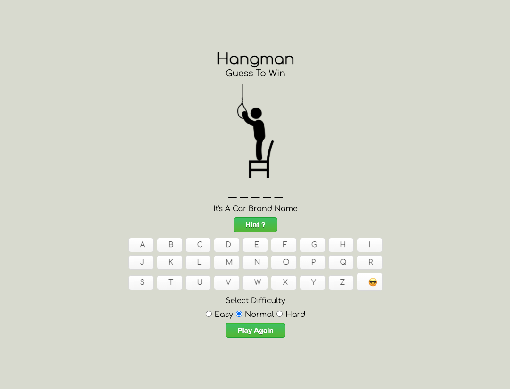
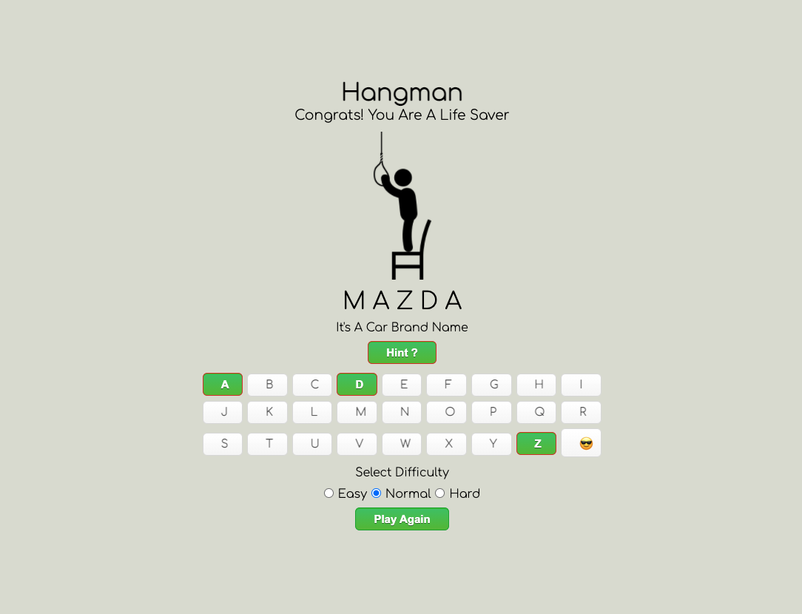
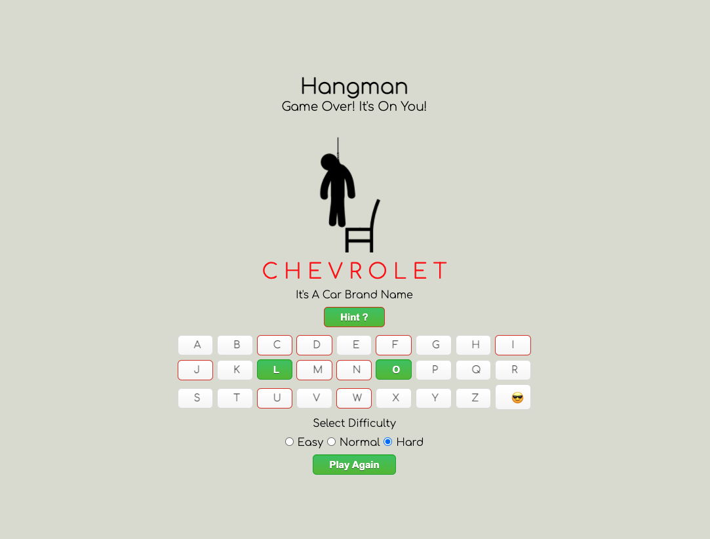
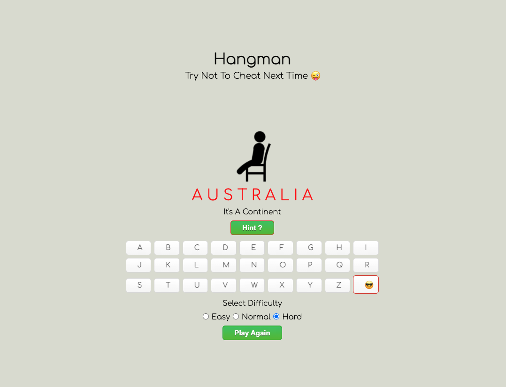
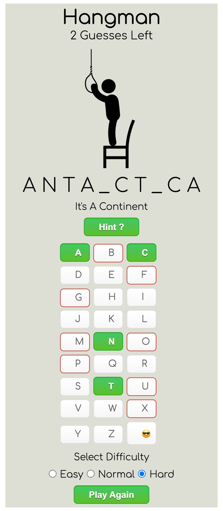

# Hangman Browser-based Game

Hangman is a popular word guessing game where the player attempts to build a missing word by guessing one letter at a time. After a certain number of incorrect guesses, the game ends and the player loses. The game also ends if the player correctly identifies all the letters of the missing word.

---

## Technologies Used

- HTML
- CSS
- JavaScript
- DOM Manipulation

---

## Added Features

### Difficulty Level

Difficulty levels are selected by the player.

- Easy
- Normal
- Hard

However, Normal difficulty level is set by default

### Hint

In addition to category, Hint is available for easy and normal difficulty levels.

- Easy - First and Last Letters

- Normal - First Letter only

- Hard - No hint - Category is available

### Cheat Button

If it's too hard to guess, you can always see the secret word. Just to save the man!

### Win and Loss

If the player correctly identifies all the letters it's a win otherwise is a lose.

### Button/Keyboard styling

If the player clicks on the correct letter, the key will change to green, otherwise it will change to red

### Disabled Key

keyboard keys are clicked only once

---

## Screenshot

- [Home Page](#home-page)
- [Winner Display](#winner-display)
- [Game Over](#game-over-display)
- [Cheat Button Display](#cheat-button-display)
- [Phone Screen (iPhone X)](#phone-screen)

### Home Page

### Winner Display

### Game Over Display

### Cheat Button Display

### Phone Screen (Iphone x)

## **Getting Started**

Here is a [Link](https://bereket-u.github.io/hangman-game/) to start playing! Enjoy!

---

## **Next Steps**

- MultiPlayer
- Animation
